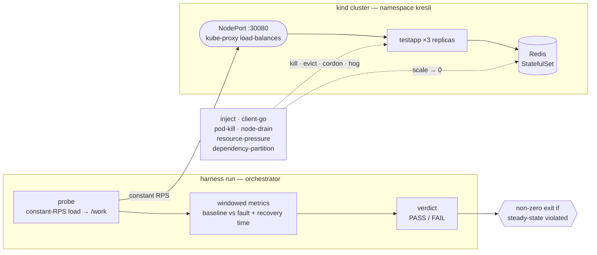
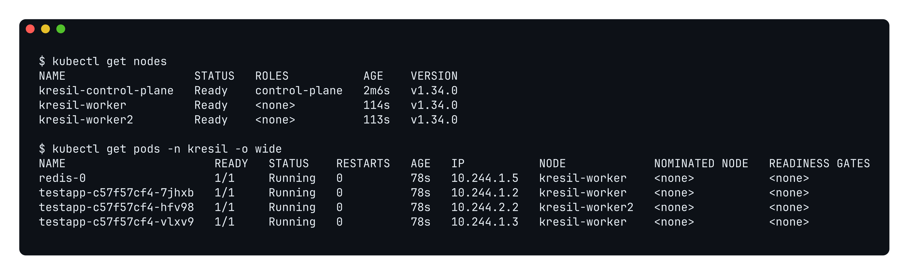
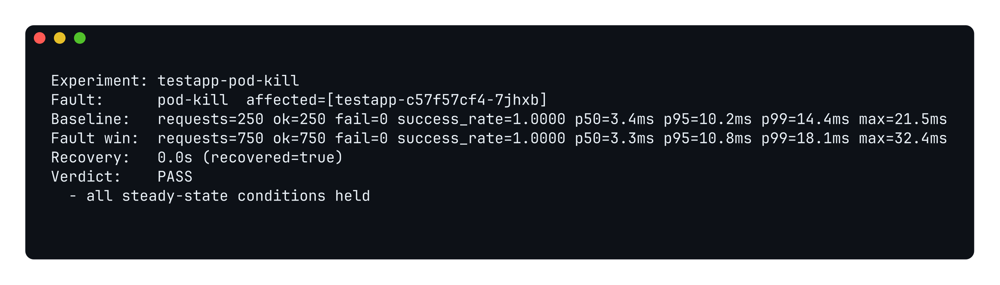
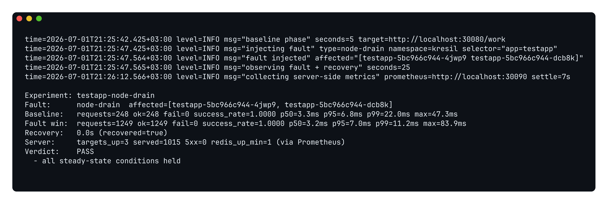
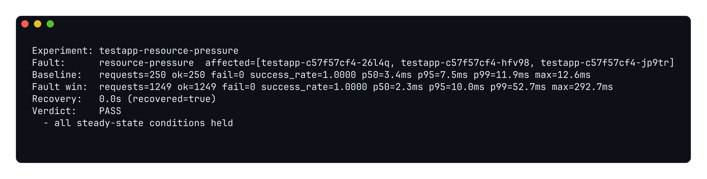
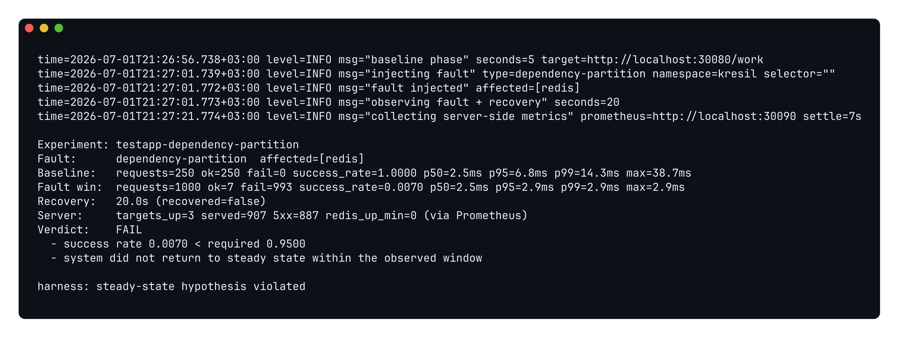

# k8s-resilience-harness

[](https://github.com/thefcan/k8s-resilience-harness/actions/workflows/ci.yml)
[](go.mod)
[](LICENSE)

> A Kubernetes resilience/chaos testing harness in Go: inject controlled faults
> into a system running on Kubernetes, check a **steady-state hypothesis**,
> measure recovery, and report a deterministic pass/fail — with an ML-based
> anomaly layer over accumulated runs.


<sub>A **real** `pod-kill` experiment on a live `kind` cluster — kill a `testapp` pod, hold the steady-state hypothesis through the fault window, emit a **PASS** verdict. Recorded end-to-end with [`scripts/record-demo.sh`](scripts/record-demo.sh); no edits.</sub>

This is a learning/portfolio project, built milestone by milestone. It does
**not** claim production Kubernetes operations experience; it is an honest,
runnable artifact that demonstrates resilience testing of a distributed system.

## Why

Distributed systems fail in ways unit tests never see: a pod is killed
mid-request, a node drains, the network slows. The only way to trust that a
system survives those events is to cause them on purpose and measure what
happens. This harness automates that loop — define a steady-state hypothesis,
inject a fault, and get a reproducible pass/fail plus a recovery-time number —
so resilience becomes a CI gate rather than a hope.

---

## Status

**Milestone M3 (done) — four pluggable fault injectors across both the PASS and FAIL paths: `pod-kill`, `node-drain`, `resource-pressure`, `dependency-partition`.**

The harness drives constant load at a multi-replica `testapp` (backed by a Redis
StatefulSet) running in a local [`kind`](https://kind.sigs.k8s.io/) cluster,
injects a fault via `client-go` (kill a random pod, cordon a node and evict its
pods, pin a bounded CPU-hog onto the workload's node, or partition the workload
from its datastore), and judges the run against a declarative **steady-state
hypothesis** — emitting a deterministic pass/fail verdict, a recovery time, and a
JSON + human report. A violated hypothesis fails the process (and the CI build) —
exercised for real by the `dependency-partition` experiment.

```text
M0  skeleton + kind cluster bring-up        ✅ done
M1  SUT + loadgen + baseline steady-state   ✅ done
M2  pod-kill injector + verdict + report    ✅ done
M3  more fault types                        ✅ done
    ├─ node-drain (cordon + evict)          ✅ done
    ├─ resource-pressure (bounded CPU-hog)  ✅ done
    └─ dependency-partition (the FAIL path) ✅ done
M4  Prometheus metrics platform             ⬜ planned
M5  scikit-learn anomaly analysis           ⬜ planned
M6  polish: README, diagram, docs           ⬜ planned
```

📊 **Measured results & metrics** — real experiment outcomes across the PASS and
FAIL paths, test coverage, and CI status are collected in
[`docs/RESULTS.md`](docs/RESULTS.md). Every number there is reproduced by
`make demo` and by CI on every push.

---

## Requirements

- Go 1.26+
- Docker (running)
- `kind` (`go install sigs.k8s.io/kind@v0.30.0`)
- `kubectl`
- `golangci-lint` v2 (for `make lint`)

## Quickstart

```bash
# Full demo in one command:
#   kind cluster -> build/load image -> deploy -> baseline -> pod-kill experiment
make demo

# ...or step by step:
make cluster-up        # 1 control-plane + 2 workers
make images            # build testapp image, load into kind
make deploy            # apply manifests, wait for Redis + testapp
make baseline          # loadgen -> results/baseline.json
make experiment        # harness run pod-kill -> results/pod-kill.json (+ verdict)

# Lint + unit tests with the race detector
make lint
make test

# Tear the cluster down
make cluster-down
```

Run `make help` to list all targets. To run an experiment directly:

```bash
go run ./cmd/harness run -experiment experiments/pod-kill.yaml             -out results/pod-kill.json
go run ./cmd/harness run -experiment experiments/node-drain.yaml           -out results/node-drain.json
go run ./cmd/harness run -experiment experiments/resource-pressure.yaml    -out results/resource-pressure.json
go run ./cmd/harness run -experiment experiments/dependency-partition.yaml -out results/dependency-partition.json
# exits non-zero if the steady-state hypothesis is violated (dependency-partition does, by design)
```

---

## Layout

```text
cmd/harness/          # harness CLI: `harness run -experiment <file>`
testapp/              # SUT: multi-replica HTTP service (/livez, /healthz, /work) + Dockerfile
loadgen/              # constant-RPS load generator -> baseline report
internal/
  buildinfo/          # version metadata (ldflags-stamped)
  logger/             # structured slog logger (text/json, levels)
  metrics/            # success rate + latency percentiles (shared)
  experiment/         # declarative experiment model: parse + validate
  k8s/                # client-go clientset (in-cluster or kubeconfig)
  inject/             # fault injectors — Injector iface: pod-kill, node-drain, resource-pressure, dependency-partition
  probe/              # in-fault prober + windowed metrics + recovery time
  report/             # verdict + JSON / human report
deploy/base/          # kustomize: namespace, Redis StatefulSet, testapp Deployment
experiments/
  pod-kill.yaml             # declarative pod-kill experiment
  node-drain.yaml           # declarative node-drain experiment (cordon + evict)
  resource-pressure.yaml    # declarative resource-pressure experiment (bounded CPU-hog)
  dependency-partition.yaml # declarative partition experiment (expected FAIL)
scripts/              # cluster-up/down, build-images, deploy, baseline
results/              # run outputs (baseline.json, pod-kill.json, node-drain.json, ...)
.github/workflows/    # CI: lint+test, integration (deploy + baseline + experiment)
```

## Architecture



The same system on a live 3-node `kind` cluster — three `testapp` replicas
spread across two workers behind the Service, backed by a Redis StatefulSet:



- **`testapp`** — `/livez` (liveness, independent of Redis), `/healthz`
  (readiness, reflects Redis reachability + drains on SIGTERM), `/work` (atomic
  Redis INCR). Generic error bodies; details are logged server-side.
- **NodePort, not port-forward** — load is driven through a kind-published
  NodePort so kube-proxy load-balances across all three replicas and re-routes
  around a killed pod. A graceful drain (fail readiness, wait, then shut down)
  keeps pod deletion from producing spurious connection errors — both needed
  for honest M2 fault measurements.
- **Pluggable injectors** — `inject.Injector` is a small interface
  (`Inject → affected pods`, `Rollback`). `pod-kill` deletes random selector-matched
  pods (rollback is a no-op; the Deployment recreates them). `node-drain` cordons
  one node hosting the workload and evicts *only the experiment's* pods from it via
  the Eviction API, then **uncordons on rollback** so repeated runs don't strand the
  cluster (`topologySpread: ScheduleAnyway` lets evicted pods reschedule onto the
  surviving worker). `resource-pressure` pins a **bounded CPU-hog** (capped at half a
  CPU) onto a node hosting the workload so its replicas there compete for CPU, and
  **deletes the hog on rollback**. `dependency-partition` is the odd one out — it is
  *expected* to fail: it scales the Redis StatefulSet to zero for the fault window so
  `testapp` is cut off from its datastore, then restores the original replica count on
  rollback, exercising the harness's FAIL path. The first three are selector-scoped
  (they disrupt only the experiment's own workload, never system pods); all four are
  unit-tested against a `client-go` fake clientset.
- **`loadgen`** — paced ticker + bounded worker pool; in-flight requests are not
  cancelled when the duration elapses. Pool saturation is counted separately, so
  `achieved_rps` reflects requests actually sent, not ticks emitted.
- **`internal/metrics`** — latency percentiles use nearest-rank over *successful*
  requests only; reused by the in-fault probe in M2.

## Experiments & verdict

An experiment is declarative — a steady-state hypothesis, a fault, and the phase
timing ([`experiments/pod-kill.yaml`](experiments/pod-kill.yaml)):

```yaml
steadyState:
  minSuccessRate: 0.95
  maxP95Ms: 300
fault:
  type: pod-kill
  namespace: kresil
  selector: app=testapp
  count: 1
phases:
  baselineSeconds: 5
  faultSeconds: 15
  recoveryTimeoutSeconds: 30
```

The harness measures a baseline, kills a pod, then measures the fault window and
recovery time, and checks the hypothesis. A real PASS run against the kind
deployment (full data in [`results/pod-kill.sample.json`](results/pod-kill.sample.json)):



With three replicas behind a load-balanced Service and a graceful drain, killing
one pod stays within steady state and recovers immediately. If the hypothesis is
violated, the harness prints the failing condition and exits non-zero.

### node-drain

[`experiments/node-drain.yaml`](experiments/node-drain.yaml) swaps in the second
injector: instead of deleting a pod, it cordons one worker node hosting `testapp`
and evicts that workload's pods from it, forcing them to reschedule onto the
surviving worker. The phase timing allows a longer recovery window because a
reschedule is slower than a Deployment replacing a single deleted pod:

```yaml
fault:
  type: node-drain
  namespace: kresil
  selector: app=testapp
phases:
  baselineSeconds: 5
  faultSeconds: 25
  recoveryTimeoutSeconds: 45
```

A real PASS run against the kind deployment (full data in
[`results/node-drain.sample.json`](results/node-drain.sample.json)):



The load-balanced Service routes around the evicted pod while it reschedules, so
steady state holds throughout. After the run the harness uncordons the node, so
the cluster is left exactly as it was found.

### resource-pressure

[`experiments/resource-pressure.yaml`](experiments/resource-pressure.yaml) is a
*sustained* fault rather than a transient one: it pins a CPU-hog to a node hosting
`testapp`, so the replicas there fight for CPU for the whole fault window. Because
contention costs latency, the hypothesis loosens the p95 ceiling — while still
demanding the Service serve essentially every request:

```yaml
fault:
  type: resource-pressure
  namespace: kresil
  selector: app=testapp
steadyState:
  minSuccessRate: 0.95
  maxP95Ms: 500          # looser than the transient faults — pressure costs latency
```

A real PASS run against the kind deployment (full data in
[`results/resource-pressure.sample.json`](results/resource-pressure.sample.json)):



The hog is capped at half a CPU, so it stresses the node without destabilising the
host running kind — visible above as tail latency climbing (p99 and max rise under
the contention) while success rate holds. The harness deletes the hog on rollback.

### dependency-partition (the FAIL path)

The first three faults are ones the system is built to ride out — so they all
**PASS**. A resilience harness that only ever prints PASS proves nothing, so
[`experiments/dependency-partition.yaml`](experiments/dependency-partition.yaml)
deliberately breaks something the system *can't* survive: it scales the Redis
StatefulSet to zero for the fault window, cutting `testapp` off from its datastore.

```yaml
fault:
  type: dependency-partition
  namespace: kresil
  dependency: redis          # the StatefulSet taken down for the fault window
```

A real run against the kind deployment (full data in
[`results/dependency-partition.sample.json`](results/dependency-partition.sample.json)):



With Redis gone, `/work` can't complete: the success rate collapses to **0.6%**, the
system never returns to steady state, and the harness emits a **FAIL** verdict and
**exits non-zero** — which is exactly the point. CI runs this experiment as a
*negative test* (it asserts the harness fails), so the steady-state gate is proven to
actually fire. On rollback the harness scales Redis back to its original replica
count, leaving the cluster as it was found.

## CI

GitHub Actions runs two jobs on every push/PR:

- **lint + unit tests** — `golangci-lint`, `go test -race ./...`, `go build`.
  Unit tests cover the verdict logic, percentile math, all four injectors —
  pod-kill, node-drain, resource-pressure and dependency-partition (via a
  `client-go` **fake clientset**) — and the load/probe engines.
- **integration (kind deploy + experiments)** — installs `kind`, builds and
  loads the image, deploys via the project's own scripts, measures the baseline
  (**fails if success rate < 95%**), then runs the pod-kill, node-drain and
  resource-pressure experiments (**each fails the build if its steady-state
  hypothesis is violated**), and finally the dependency-partition experiment as a
  **negative test** — the build fails unless the harness *correctly* reports a FAIL
  and exits non-zero. All reports are uploaded as artifacts.

## License

MIT — see [LICENSE](LICENSE).
